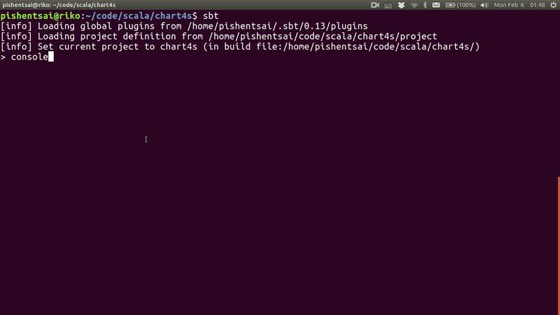

# chart4s

Draw a web chart by Scala.



The charts are generated by [C3.js](http://c3js.org/). Support for other JavaScript libraries may come in the future.

## Installation

Add the following to your `build.sbt`:

```
libraryDependencies += "net.pishen" %% "chart4s" % "0.1.0"

resolvers += Resolver.bintrayRepo("pishen", "maven")
```

Then, add the import statements to your code:

```scala
import chart4s._
import chart4s.c3._
```

## Supported charts

### Line Chart

```scala
val lines = Seq(
  "a" -> Seq(3.1,6.4,2.3,7.5,5.0,8.9),
  "b" -> Seq(5.4,3.3,7.0,2.7,3.9,5.2)
)

val xValues = Seq(0.1, 0.2, 0.3, 0.45, 0.5, 0.6)

LineChart(lines, xValues).draw
```

### Bar Chart

```scala
val data = Seq(
  "a" -> Seq(3.1,6.4,2.3,7.5,5.0,8.9,7.7),
  "b" -> Seq(5.4,3.3,7.0,2.7,3.9,5.2,9.1)
)

val xValues = Seq("Sun", "Mon", "Tue", "Wed", "Thu", "Fri", "Sat")

BarChart(data, xValues).draw
```

### Pie Chart

```scala
PieChart(Seq("a" -> 5, "b" -> 3, "c" -> 11)).draw
```

### Stacked Line Chart

```scala
val lines = Seq(
  "a" -> Seq(3.1,6.4,2.3,7.5,5.0,8.9),
  "b" -> Seq(5.4,3.3,7.0,2.7,3.9,5.2)
)

val xValues = Seq(0.1, 0.2, 0.3, 0.45, 0.5, 0.6)

StackedLineChart(lines, xValues).draw
```

### Timeseries Chart

```scala
import java.time.LocalDate //also works for LocalDateTime

val lines = Seq(
  "a" -> Seq(3.1,6.4,2.3,7.5,5.0,8.9),
  "b" -> Seq(5.4,3.3,7.0,2.7,3.9,5.2)
)

val now = LocalDate.now
val timeValues = Seq(0, 1, 2, 4, 5, 6).map(d => now.plusDays(d))

TimeseriesChart(lines, timeValues).draw
```

### XY Line Chart

```scala
XYLineChart(Seq(
  "a" -> Seq(1 -> 1, 2 -> 2, 3 -> 3, 4 -> 5, 5 -> 8, 6 -> 13),
  "b" -> Seq(5 -> 1, 6 -> 2, 7 -> 3, 8 -> 5, 9 -> 8, 10 -> 13)
)).draw
```
